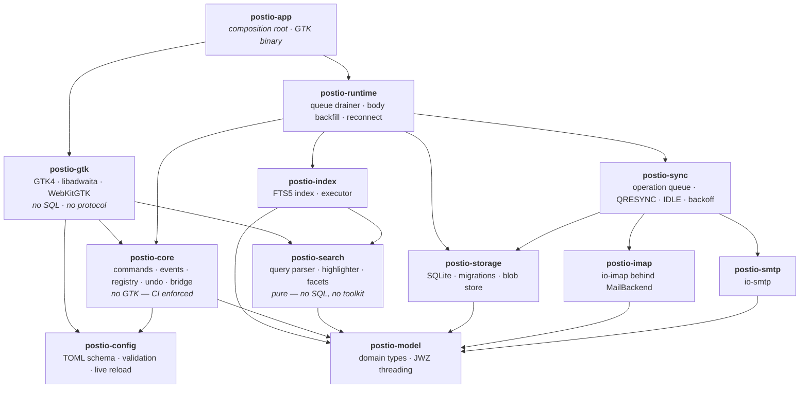

# Postio

Postio is a local-first, keyboard-first email client built for people who
have too much email.

Read less. Find anything. Act faster.

Postio keeps a full copy of your mail in a local SQLite database with a
built-in full-text index, so search and navigation never wait on the
network. Every action — archive, flag, move, delete, undo — applies
instantly to that local copy and is queued for the server in the
background. The UI never awaits the network.

## Status

Postio is pre-release and under active development. The core mail
experience — accounts, sync, threading, search, the three-pane reading
layout, keyboard navigation, compose — is being built out epic by epic;
see [`docs/PRODUCT.md`](docs/PRODUCT.md) for what Postio must do, and the
design canvas at [`Design/Mail Client.dc.html`](Design/Mail%20Client.dc.html)
for the visual target.

**v1 scope:** Linux (GTK4/libadwaita) only, IMAP + SMTP only, targeting
iCloud with an app-specific password (no OAuth). SQLite for metadata,
threading, sync state and full-text search, plus a content-addressed blob
store for raw messages and attachments — no maildir/mbox/notmuch, no store
picker.

**Deliberately not in v1:** other platforms, other protocols, OAuth, and
AI features (rules/filters, smart labels, MCP support) — all founding
ideas for later, tracked separately so the core mail experience lands
first.

Screenshots of the running app will go here once the shell (E7) is far
enough along to be worth a picture — see `docs/images/`.

## This codebase is almost entirely AI-generated

Postio is written by AI coding agents — Claude, running in parallel
sessions — under the direction of a human maintainer who sets scope,
reviews the results, and makes the product decisions. That is not a
disclaimer; it is the experiment. The interesting question is not whether
an agent can emit code, but whether a *process* can make agent-written
software trustworthy, and this repository is built around that question:

- **Every piece of work is a GitHub issue**, worked in its own branch,
  landed as a PR. The issue history is the reasoning, in public.
- **Test-driven development is mandatory**, for agents exactly as it
  would be for people: the failing test is written first, and CI enforces
  a gate chain — tests, clippy as errors, formatting, architectural
  boundary checks, a personal-data scanner, license and advisory audits
  on every dependency.
- **The invariants are machine-checked, not remembered.** A crate that
  must not link GTK, a view layer that must not speak SQL, a log that
  must never contain message content — each is a script in CI, because a
  rule an agent (or a person) has to remember is a rule that drifts.
- **Decisions are written down** as [ADRs](docs/decisions/) with their
  alternatives and costs, and hard-won lessons live in
  [`docs/engineering-notes.md`](docs/engineering-notes.md) so the next
  session does not relearn them.

Read the code with the same skepticism you would give any codebase — and
if you find something wrong, the issue tracker is where this project
thinks. See [`CONTRIBUTING.md`](CONTRIBUTING.md) for how to file an issue
an agent can act on, including handing us the prompt you would run.

## Building and running

### System dependencies

Fedora 40+ (developed and tested on Fedora 44 / GNOME 50 / Wayland):

```bash
sudo dnf install gtk4-devel libadwaita-devel webkitgtk6.0-devel \
                 sqlite-devel libsecret-devel glib2-devel pkgconf-pkg-config
```

Ubuntu 26.04 (earlier releases ship a GTK older than the 4.20 feature
floor this project pins):

```bash
sudo apt install build-essential pkg-config libgtk-4-dev libadwaita-1-dev \
                 libwebkitgtk-6.0-dev libsqlite3-dev libsecret-1-dev \
                 libglib2.0-dev libpango1.0-dev
```

Rust is pinned by [`rust-toolchain.toml`](rust-toolchain.toml) — with
[rustup](https://rustup.rs) installed, the right compiler arrives on the
first `cargo` command; no version to pick.

Verified working against: gtk4 4.22.4, libadwaita-1 1.9.3,
webkitgtk-6.0 2.52.5, sqlite3 3.51.2, libsecret-1 0.21.7, glib-2.0 2.88.3.

### Build

```bash
cargo build --workspace
```

### Run

```bash
cargo run -p postio-app
```

There is also a Flatpak manifest — see [`flatpak/`](flatpak/) — which is
what a Flathub release will build from.

### First run

Postio opens onto a one-screen setup: type your email address, and the
autoconfig probe fills in the server settings (a preset table, Thunderbird
autoconfig, then DNS SRV — or manual entry if your provider answers to
none of them). The password goes straight into the OS keyring; it is
never written to a file. iCloud accounts need an app-specific password
from <https://account.apple.com> — iCloud does not accept account
passwords over IMAP.

After the first sync, drive it from the keyboard:

| | |
|---|---|
| `j` / `k` | next / previous message |
| `Enter`, `t` | open a message / its thread |
| `e` | reply |
| `a` / `A` | archive message / whole thread |
| `u` | undo — any action, after the fact |
| `/` | search (`from:ada is:unread has:attach …`) |
| `Ctrl+K` | the command palette — every command, searchable |
| `?` | the full cheat sheet |

Every binding is rebindable; the complete generated reference is
[`docs/keybindings.md`](docs/keybindings.md).

### Test

```bash
cargo test --workspace                  # never touches the network
cargo test --workspace -- --ignored     # live iCloud tests; needs POSTIO_TEST_* env
cargo clippy --workspace --all-targets -- -D warnings
cargo bench                             # perf budgets — see "It must feel instant" below
```

Development is test-driven: a failing test is written before the code
that makes it pass, for every crate. See
[`CONTRIBUTING.md`](CONTRIBUTING.md) for how to contribute — as a person
or by pointing an agent at an issue — and [`CLAUDE.md`](CLAUDE.md) for
the agent workflow, commit conventions, and the architectural invariants
CI enforces.

### It must feel instant

Performance is a functional requirement, enforced by `cargo bench` rather
than checked by hand:

| Budget | Target | Measured |
|---|---|---|
| Startup to usable UI (populated DB) | < 500 ms | **147 ms** |
| Ordinary UI interaction | < 16 ms | **~2 ms** |
| Local search | < 100 ms | **27 ms** |
| Memory, 100,000 messages | no full-mailbox load | **47 MiB**, flat |

Transitions are ≤ 100 ms or absent entirely, and `prefers-reduced-motion`
is always honored. A mailbox is never loaded into memory in full — the
message list is windowed over paged SQLite.

#### The baseline

Measured on one developer machine, which makes the numbers a regression
guard rather than a promise about anybody else's hardware. Reproduce them:

```sh
cargo run -p postio-runtime --example seed_store -- /tmp/postio.db 20000
POSTIO_STORE=/tmp/postio.db POSTIO_STARTUP_TRACE=1 POSTIO_STARTUP_EXIT=1 \
  cargo run --release -p postio-app

cargo bench -p postio-runtime --bench store_reads   # the database read
cargo bench -p postio-gtk     --bench list_scroll   # the row draw
cargo bench -p postio-search  --bench search_budget --features index
```

Startup, on a 20,000-message store with an account and six folders:
147 ms, of which 47 ms is `adw::init` and 82 ms is the first frame. The
window, the styles and the fonts are 18 ms between them.

An ordinary interaction is a scroll, and a scroll is two things — a page
read and a screenful of rows drawn. Together they are the ~2 ms above:

| | 1,000 messages | 100,000 messages |
|---|---|---|
| Page read, top of the folder | 139 µs | 219 µs |
| Page read, scrolled to the middle | — | 176 µs |
| Page read, *jumped* to the middle | — | 28 ms |
| Row draw, one screenful | 1.6 ms | 1.6 ms |

Flat against mailbox size, which is the claim that matters: reading page
one of a hundred thousand messages costs what reading page one of a
thousand costs. The exception is a *jump* to a page nobody has scrolled
through — the store has no boundary to seek from and falls back to walking
— which happens once per jump, and every page after it is the 176 µs row.

Search, over a 120,000-message index, by query shape:

| Query shape | Measured |
|---|---|
| Composed — an operator plus free text, what the search bar usually produces | 0.45 ms |
| Simple term — a word matching about 1% of the corpus | 7.0 ms |
| Operator only — `from:`, no free text and no FTS join | 12.4 ms |
| Common word — a word in every message, the worst case | 26.4 ms |
| Common word, with facet counts | 27.5 ms |

The worst shape is the one to watch: `MATCH` and the `count(*)` behind it
have to walk effectively the whole corpus, and it is where a missing index
would show up first.

#### Memory, and the claim it tests

A mailbox is never loaded into memory in full. Measured rather than
asserted, by sampling `/proc/<pid>/status` while the application is open on
a store of each size:

| | 1,000 messages | 100,000 messages |
|---|---|---|
| Anonymous — the application's own heap | 47 MiB | 47 MiB |
| File-backed — mapped store, WAL, shared libraries | 83 MiB | 167 MiB |
| Resident total | 131 MiB | 215 MiB |

**The anonymous figure is the claim.** It is what Postio itself allocates —
the windowed list model, the widgets, the runtime — and it does not move
between a thousand messages and a hundred thousand. The file-backed half
grows because `PRAGMA mmap_size` is 256 MiB and SQLite maps as much of the
store as it touches; those are reclaimable page-cache pages, not mail the
application is holding on to.

Reproduce it:

```sh
cargo run --release -p postio-runtime --example seed_store -- /tmp/big.db 100000
POSTIO_STORE=/tmp/big.db cargo run --release -p postio-app &
grep -E '^(VmRSS|RssAnon|RssFile):' /proc/$!/status
```

## Configuration

Postio reads `config.toml` from `$POSTIO_CONFIG`, or else
`$XDG_CONFIG_HOME/postio/config.toml`, or else
`~/.config/postio/config.toml`. A missing file is fine — first run needs
nothing on disk — and the file is live-reloaded on save.

**No credential ever lives in `config.toml`.** Passwords and
app-specific passwords go in the Secret Service keyring; an account in
the file only references a keyring entry.

```toml
[ui]
density = "airy"          # airy | comfortable | compact
theme = "system"          # system | light | dark

[accounts.personal]
email = "ada@example.com"
display_name = "Ada"
default = true

[accounts.personal.imap]
host = "imap.example.com"
port = 993
security = "implicit-tls"

[accounts.personal.smtp]
host = "smtp.example.com"
port = 465
security = "implicit-tls"

[sync]
idle = true

[keys]
archive = "y"             # overrides the default binding for `archive`
```

For iCloud, use the app-specific password you generate at
<https://appleid.apple.com/account/manage> — iCloud does not support
plain account passwords for IMAP/SMTP.

Sections in brief:

- `[ui]` — density, theme, hover actions, thread drill-in.
- `[accounts.<id>]` — one table per account: address, display name, and
  nested `[accounts.<id>.imap]` / `[accounts.<id>.smtp]` server settings.
- `[sync]` — IDLE vs. polling, connection budget.
- `[filters]` — named saved search queries.
- `[keys]` — command id to key binding, overriding the defaults below.

Any key this version of Postio does not recognize is preserved verbatim
on save, so a config file survives a downgrade.

## Keybindings

Postio is built to be driven entirely from the keyboard. The full
reference — every command, its default binding, where it applies, and
whether it's undoable — is generated from the command registry and lives
in [`docs/keybindings.md`](docs/keybindings.md), so it can never drift
out of sync with the running application. Every binding is rebindable
from `[keys]` in `config.toml`, and the running app's `?` cheat sheet and
`Ctrl+K` command palette are generated from the same table.

## Architecture



Arrows are "depends on", and every arrow drawn is a real direct dependency.
Two sets are left out to keep the layering legible: `postio-app`'s direct
edges to most leaves (it is the composition root — it assembles them, which
says nothing about rank), and edges already implied by a path through the
diagram, such as `postio-runtime -> postio-search` or the fact that very
nearly everything depends on `postio-model`.

- **`postio-app`** opens the store, starts the engine and runs the UI. The
  only crate that knows both halves exist.
- **`postio-gtk`** is the view layer: command down, event up.
- **`postio-runtime`** is the database half — the store, and the loop that
  drains the operation queue, backfills bodies and reconnects.
- **`postio-core`** is the UI-agnostic contract under both halves.
- **`postio-search`** is a pure leaf, not a frontend detail: the query
  language is shared by the search bar, the FTS5 executor in
  **`postio-index`**, and `[filters]` in `config.toml`. One matching
  language, one syntax to learn.

`postio-core` has no GTK dependency and `postio-gtk` has no SQL or protocol
dependency. Both are enforced against `cargo metadata`'s resolved graph by
`scripts/check-crate-boundaries.py`, so a violation arriving transitively is
caught too.

See [`docs/ARCHITECTURE.md`](docs/ARCHITECTURE.md) for the decisions behind
this shape and why each one is load-bearing,
[`docs/decisions/`](docs/decisions/) for the long-form ADRs, and
[`docs/architecture-review-2026-08.md`](docs/architecture-review-2026-08.md)
for the standing critique and known gaps.

## License

MIT — see [`LICENSE`](LICENSE).
