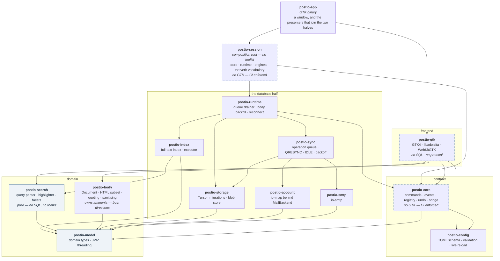

# Postio architecture

How Postio is put together, and **why** — the decisions that are load-bearing,
so a change that would break one is recognisable as such before it is written.

Scope note: this describes what is **built**, as of 0.4.0. Where a decision is
made but not yet implemented it says so explicitly. `docs/decisions/` holds
the long-form ADRs, with [an index](decisions/README.md) of where each one
stands. The August 2026 outside review that shaped several of them is kept
in [`docs/archive/`](archive/); every finding it raised has since landed.

---

## The shape



Arrows are "depends on", and every arrow drawn is a real direct dependency.
Two sets are left out to keep the layering legible: `postio-session`'s direct
edges to most leaves (it is the composition root — it assembles them, which
says nothing about rank), and edges already implied by a path through the
diagram, such as `postio-runtime -> postio-search` or the fact that very
nearly everything depends on `postio-model`.

`postio-app` and `postio-session` are one rank, split along one line: does it
name a toolkit. Everything the application *is* — the store, the runtime, the
engines, and the verb vocabulary that turns a `Command` into rows and events —
is in `postio-session`, which a frontend that is not GTK can link. What is left
in `postio-app` is a window and the presenters that join the two halves, each
of which names a widget. See [ADR 0010](decisions/0010-mcp-surface.md) for why
the alternative — a second binary opening the store directly — is not a second
frontend but a second application sharing a file.

Dashed borders mark the three crates whose dependency closure CI polices
(`scripts/checks/check-crate-boundaries.py`).

---

## The decisions

### 1. Commands down, events up — and the UI never awaits the network

The frontend never mutates anything. It sends a `Command` and repaints from the
`Event`s that come back. Every mutating action follows the same order:

> **Store write → enqueue the remote operation → emit the event → repaint.**

The network is not in that sequence. `postio-sync` drains the queue later and
somewhere else, and reports back through its own events.

**Why:** it is what makes Postio work on a train, and what makes it reconcile
when the link returns. It is also the only version of "feels instant" that
survives a slow server — a design that awaits the server is fast only when the
server is.

**How it is held:** `postio-core::bridge` is the single place the tokio half and
the UI main loop touch, in both directions, over unbounded non-blocking
channels. `send` returns immediately; the frontend drains the event stream from
its own loop. No GTK type appears in that module, and none may.

### 2. The registry is the source of truth for every command surface

`PRODUCT.md` §8 wants every command to have a keyboard shortcut, a palette entry
and an accessible action. There is **one enumerable table** — `postio-core::registry` —
and the keymap, the `Ctrl+K` palette, the `?` cheat sheet, the right-click menu,
the action bars' key caps and `docs/keybindings.md` are all *derived*
from it.

**Why:** three hand-maintained lists drift within a release. One table cannot.

**Consequence to respect:** a command that is not in the registry **does not
exist** — not merely unbound, but absent from every way a user could discover
it. An extension mechanism must therefore register rather than bypass, or
extension commands become second-class in exactly the surfaces that make the
app good.

**How an extension command reaches those surfaces** (`postio-plp4`, ADR 0002):
`registry::register` takes an owned `ExtCommand` with a namespaced id —
`"mcp:summarise-thread"` — and returns an interned `ExtId`. `ActionId` is the
union of that and the built-in `CommandId`, and it is what the keymap, the
palette, the cheat sheet and the key hints deal in; `registry::reachable`
yields the merged vocabulary for a context. `registry::all` and `get` still
mean *the built-in table*, so `docs/keybindings.md` keeps documenting what
ships.

Three properties worth not losing:

- `CommandId` stays closed, fieldless and `Copy`. `registry::get` is
  `SPECS[id as usize]`, and rustc allows that cast only for a fieldless enum,
  so a data-carrying variant would cost the registry its O(1) shape. This is
  why the seam is `ActionId` rather than a new `CommandId` variant.
- Extension commands are equal to built-ins where it matters to the *user* —
  palette, cheat sheet, `[keys]` — and distinguishable where it matters to the
  *compiler*. Dispatch keeps a `Command`-typed path for built-ins and a
  parallel `ExtId`-keyed one for registrations, because a built-in is
  statically known to have a handler and carries a typed payload, and an
  extension is neither.
- **`destructive: true` with `Recovery::None` is rejected at registration.**
  For the built-in table that invariant is a test over a literal; a table that
  grows at runtime cannot be checked that way, so the check moved into the
  door. An AI- or plugin-invoked destructive action with no undo is worse than
  a built-in one, because the user did not type it.

The right-click menu is the one surface that stays built-in only. It is a
`PopoverMenu` with no query box and no ranking, so it has no answer for a
vocabulary that grows, and its contents would otherwise depend on what is
installed rather than on which build you are running — and right-click is
muscle memory in a way `Ctrl+K` deliberately is not.

**Bonus the table buys:** `destructive` and `recovery` are fields, so
"a destructive command must be recoverable" is machine-checked rather than a
review habit.

### 3. Command ids are a file format

`CommandId` serialises as a stable string, because `[keys]` in `config.toml`
refers to commands by id. Renaming one silently breaks a user's configuration.
A test holds `postio-core`'s ids and `postio-config`'s `DEFAULT_BINDINGS`
together so they cannot drift.

### 4. Selection is a predicate, not a list — and it is not the cursor

Two separate decisions that are usually conflated, and both are correctness
issues rather than preferences.

**The list has a cursor *and* a selection.** The cursor is where the keyboard
is: `j`/`k` move it and the reading pane follows. The selection is what `a`
would archive. Most of the time they are the same row, which is exactly why
conflating them is the classic bug — it only surfaces once a selection is more
than one row, and then every bulk action lands somewhere the user did not
expect. `GtkSingleSelection` is the *cursor* here; the name is GTK's, the
meaning is Postio's.

**"Select all" is a predicate.** `Selection::Everything { except }`, never a
`Vec`. Selecting a 100k mailbox and taking three rows back out is four ids, and
archiving it is one statement for the store to resolve rather than 100k of
anything. This is why `Event::SelectionChanged` carries the selection rather
than a list of ids: an event that flattened it would undo the reason it exists.

Related: **the message list is never loaded into memory.** It is windowed over
the paged store (`PRODUCT.md` §18).

### 5. Undo replays inverses through the same machinery

An undo entry carries its inverse as `Command`s, and undo applies them through
the path the original action used — but with `Recording::Replay`, so nothing is
pushed back onto the stack. Sending them through the bus instead would record
an undo of the undo, and `u` `u` would toggle rather than walk back through
history.

### 6. One matching language: searches, saved searches, virtual folders, filters

**The decision:** Postio has exactly one way to express *which messages* — the
search query language. Everything that selects a set of mail is that language
wearing a different hat.

| Concept | Is | Status |
|---|---|---|
| A search | A query | Built |
| A saved search | A query with a name | Built (`Ctrl+S` on a search; renamed, reordered and deleted from the sidebar) |
| A virtual folder in the sidebar | A saved search that is pinned | Built |
| A rule | An ordered `[[rules]]` entry naming actions, optionally reusing a named `[filters]` query rather than `[filters]` itself growing actions (ADR 0008 Q4) | Not built ([#5](https://github.com/dlapiduz/postio/issues/5)); the engine lives on `feature/rules` |

`crates/postio-config/src/filters.rs` implements the schema and names it
exactly this way — *"`[filters]` — named saved queries"* — with a `pinned`
field meaning "show this filter in the sidebar":

```toml
[filters.needs-reply]
query  = "is:unread from:team"
pinned = true
```

The sidebar renders pinned filters, the settings window edits them, and a
saved search re-runs its query when opened. There is no rules engine on
`main`: ADR 0008, 0028 and 0030 decide its shape, and the implementation
waits on an unmerged branch.

**Why one language:** there is one matching engine to write and one syntax for
a user to learn. Dry-run — showing what a rule *would* match before enabling it
— comes almost free, because it is just running the query. A second matching
language for rules would mean two parsers, two sets of operator semantics, two
bug surfaces, and a rule that does not agree with the search bar about what
`from:team` means.

**The boundary that keeps this honest:** parsing lives in `postio-search`,
which is pure — no SQL, no toolkit, `postio-model` only. `postio-config` keeps
queries as *text* and does not parse them. `postio-index` executes a parsed
query against the engine's full-text index. So the same string means the same thing whether it was
typed in the search bar, saved to the sidebar, or written into `config.toml` in
`$EDITOR`.

**What this decision does NOT say.** A real IMAP mailbox is *not* a saved
search. It is server state with a `UIDVALIDITY`, a message set that physically
lives there, and a `MailboxRole` (`Inbox`, `Archive`, `Sent`, `Drafts`,
`Trash`, `Junk`, `Flagged`, `Regular`). `a` archives *into* one. The sidebar
shows two kinds of thing that look alike and behave differently: real mailboxes
that mail moves between, and virtual folders that are queries re-run on open.
Collapsing that distinction would break move, archive and sync. Saved searches
are how you get a *view*; mailboxes are where mail *is*.

### 7. Providers are data, not code

`PRODUCT.md` §3 requires provider configuration to be extensible rather than
hard-coded. Server settings belong in a preset table where every provider is
one row — never a named constant, never a special-cased branch, never an
identifier like `ICLOUD_IMAP_HOST`.

**Why:** Postio is not an iCloud client. iCloud is one preset among many, and
the maintainer's own provider must not be visible in the shape of the code.
Naming a provider in a *comment* is fine where it explains a real compatibility
quirk ("some servers spell it `Sent Messages`").

### 8. The protocol crate is held at arm's length

`postio-sync` talks to the `MailBackend` trait and never to `io-imap` types.
`postio-account`'s `imap` feature is on by default but `postio-sync` depends on it
with `default-features = false`, so the pre-1.0 protocol crate and its TLS
stack are **not in the sync engine's dependency graph at all** — what is left is
the seam, its mock, autoconfig discovery and the keyring.

**Why:** `io-imap` was days old and six minor versions in eleven weeks when it
was adopted (ADR 0001). It is pinned `=0.6.0`. The seam means a breaking
release costs one adapter rather than the engine.

This is also why `postio-account`'s in-process test server is written **against
the wire** rather than against `io-imap`: a bug in the protocol crate cannot
hide inside the thing meant to catch it.

### 9. Two crate boundaries are enforced, not encouraged

- **`postio-core` must not depend on `gtk4`/`libadwaita`.** It is the
  UI-agnostic contract; this is what keeps a second frontend possible.
- **`postio-gtk` must not depend on `turso`/`io-imap`.** The view layer does
  no SQL and speaks no protocol. (`rusqlite` stays on the banned list beside
  `turso`, so the rule outlives the engine that made it.)

`scripts/checks/check-crate-boundaries.py` inspects `cargo metadata`'s **resolved
graph**, not source text, so a violation arriving transitively through an
innocent-looking intermediate is caught, and a string in a comment cannot fool
it. It counts the guarded crate's own dev-dependencies too — a test that pulls
`turso` into `postio-gtk` violates the invariant just as much as the library
would.

**This is also why `postio-runtime` and `postio-app` are separate crates rather
than features of `postio-core`.** Cargo resolves features as a *union* across
everything being built, so a `postio-core/runtime` feature would put the
database engine in the graph of every crate depending on `postio-core` the moment anything turned
it on — the view layer included. `postio-core` therefore has **no optional
dependencies at all.**

**The macOS frontend is built** ([#15](https://github.com/dlapiduz/postio/issues/15),
[ADR 0019](decisions/0019-macos-frontend.md)) — a native Swift frontend in
`macos/` over the same engine, through a UniFFI boundary in `postio-ffi`, with
the toolkit-free presentation logic extracted into `postio-ui`. It reads,
searches and pages mail; compose is deferred, and it is not yet released.

The invariant is what made that possible, and it was not a theory: measured on
2026-08-27, when the workspace had fifteen crates, **thirteen of them built and
tested on macOS with no changes at all** — everything but `postio-gtk` and
`postio-app`, which is still the exclusion set today at twenty crates.
`cargo check --workspace --all-targets --exclude postio-gtk --exclude
postio-app` exits 0 there; the whole-workspace run fails only on `glib-sys`
wanting `glib-2.0` from `pkg-config`. The boundary this section describes
turns out to be exactly where the portable half ends.

`scripts/issue-land.sh` enforces the same line at landing time: a changed crate
the host cannot build is refused rather than merged unverified, probing
`pkg-config` rather than `uname` so a Linux box without the `-dev` packages is
caught identically ([#555](https://github.com/dlapiduz/postio/issues/555)).

### 10. Design tokens are generated, never retyped

`Design/_ds/industry-*/styles.css` → `postio-gtk/src/tokens.rs` → 
`postio-gtk/data/tokens.css`. Every colour, length, radius and font stack in the
output is copied from a parsed token or computed from one. Retune the source and
the app follows.

`build.rs` compiles `tokens.rs` directly (`#[path = "src/tokens.rs"]`), so the
build script and the test suite run *exactly* the same parser — drift is caught
by a test rather than by eye. The module is `std`-only for that reason.

### 11. Privacy is a feature, not a setting

**Nothing leaves this machine that the user did not ask for.**

Remote images blocked per-sender until allowed; read receipts never automatic;
`List-Unsubscribe` One-Click only on deliberate activation; no link prefetch, no
favicon fetch, no speculative connections; no telemetry, no crash reporting, no
update ping; credentials in the OS keyring, never in `config.toml`, never in a
log.

#### Script never touches message content — in either direction

The rule attaches to **content that came from a message**, not to which widget
is on screen. Mail is attacker-controlled text; Postio's own code is not. Three
consequences, and the third is the one that is easy to forget:

- **Nothing from a message ever executes.** The reader's `WebView` has
  JavaScript off and network off, and `cid:` images resolve from the local blob
  store. Message-derived markup is sanitised before it reaches any surface —
  script, event handlers, embedded objects and `style` removed.
- **Postio's own script is not an exception to that rule, because it is not
  message content.** The composer runs a bundled editor script from the
  GResource bundle, and that is permitted: no message-derived script exists in
  its document, because quoted and forwarded content is sanitised *before* it
  is inserted. What is forbidden is script that arrived in the mail, wherever
  it would run. A composer surface still takes no network and loads no remote
  script.
- **Replies and forwards carry no script outward.** Quoted content is sanitised
  on the way in, and the outgoing body is generated from Postio's own document
  types rather than passed through, so nothing a sender wrote is re-emitted.
  This direction matters as much as the other one: Postio must never make a
  recipient run something its own user was protected from. A forwarded phishing
  mail is the most likely way that happens, and it is silent when it does.

**Logs never carry message content** — no bodies, subjects or recipient
addresses, at any level. Ids, counts and outcomes only. A debug log full of
someone's mail is the same leak as shipping their address in a fixture.

When adding anything that could make a network request, the question is not
"is this useful" but "did the user ask for it".

### 12. AI is a founding principle and is deliberately absent from v1

`PRODUCT.md` §23 is explicit: the MVP ships without AI, because core mail, search
and the keyboard have to be excellent first. Epic E12 holds the work.

Two constraints already decided, before any of it is built:

- **AI must never silently modify or send mail** (`PRODUCT.md` §12). Read and
  search tools may be exposed relatively freely; **every externally visible
  action — send, forward, delete, move, mark read — requires explicit human
  confirmation in the Postio UI.**
- **Mail is attacker-controlled text.** An agent reading mail over MCP is
  exposed to prompt injection: an attacker emails the user, the agent reads it,
  and the body contains instructions. This is an actively exploited class of
  attack against mail-reading agents, and it is the dominant design constraint
  on `postio-z3b.2` rather than an afterthought.

### 13. The composer's document is not the toolkit's buffer

**Built** ([#30](https://github.com/dlapiduz/postio/issues/30), ADR 0004). The
document is `postio_body::Document`; `composer.rs`'s `gtk::TextView` is a view
over it, and the buffer's own undo is turned off explicitly.

`GtkTextBuffer`, `NSTextStorage` and a `contenteditable` DOM disagree about
attribute runs versus nested spans, about what one undo step is, and about list
and blockquote nesting. If the composer's state is "whatever is in the
`TextBuffer`", a second frontend's composer is a rewrite rather than a port, and
the two produce subtly different HTML from identical gestures. So each
platform's editor is a *view*, and an `EditStep` is a change to the document
rather than to a widget.

Sanitisation is **bidirectional**, and the two directions are not symmetrical.
Incoming markup is *filtered* — ammonia, with the reader's allowlist. Outgoing
markup is **generated** from a closed type and never passed through: the only
route a sender's markup can take into an outgoing body is the quoting path,
which runs `postio_body::parse` into a `Document` that has no variant capable
of holding a script, a remote image or a `javascript:` href. The subset *is*
the allowlist, enforced by the compiler on the way in rather than by a filter
on the way out. The ammonia pass that still runs on outgoing HTML is a
backstop with a test asserting it never changes anything.

v1 ships a plain-text editor over that model: a `Document` of paragraphs and
text *is* a plain-text document, so what is restricted is the editor, not the
document. The rich editing surface stays in epic E10.

---

## Known gaps

Recorded rather than hidden. The August 2026 review
([`docs/archive/architecture-review-2026-08.md`](archive/architecture-review-2026-08.md))
listed seven findings, and every one has landed: `postio-session` split out of
`postio-app` with the same CI-enforced no-GTK rule `postio-core` has
([#82](https://github.com/dlapiduz/postio/issues/82)); the toolkit-free
keymap, selection and tokens moved into `postio-ui`; the sanitiser and quote
folder into `postio-body` ([ADR 0004](decisions/0004-composer-document-model.md));
the extension vocabulary and correlation ids as
[ADR 0002](decisions/0002-extensible-command-vocabulary.md); the event hub as
[ADR 0013](decisions/0013-event-fanout.md), so a second frontend subscribes
beside the window without stealing a repaint; and the boundary check now
guards ten crates against cargo's resolved graph rather than two, so
`postio-search` cannot re-acquire the store engine.

What remains open, as of 0.4.0:

| Gap | Effect | Where |
|---|---|---|
| The rules engine is designed and not on `main` | `[filters]` are saved searches only; nothing files mail on arrival | ADR 0008/0028/0030, [#5](https://github.com/dlapiduz/postio/issues/5) |
| The macOS frontend is read-only | Compose, settings edits and account setup still need the GTK app | ADR 0019 |
| `[sync] notify_roles` does not cross the FFI | The macOS build notifies for every folder, not the configured ones | `docs/notes/2026-09-13-what-the-frontend-audit-found-and-what-remains.md` |
| Wall-clock performance figures predate the engine swap | The counted budgets hold; the timings in `PERFORMANCE.md` have not been re-measured on Turso against a real mailbox | [`PERFORMANCE.md`](PERFORMANCE.md) |
